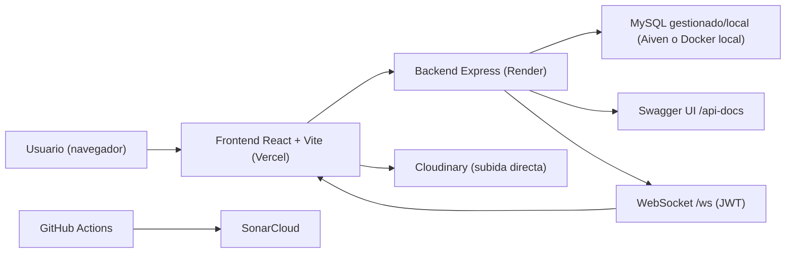

# Walter Red Social

Proyecto TFG de red social tipo comunidad-foro con tiempo real, autenticación JWT, publicación multimedia y panel de administración basado en OpenAPI.

## 1. Tecnologías (etiquetas)

`#JavaScript` `#NodeJS` `#Express5` `#MySQL8` `#mysql2` `#JWT` `#bcrypt` `#WebSocket` `#ws`
`#React19` `#Vite` `#ReactRouter7` `#FramerMotion` `#LucideReact` `#Cloudinary`
`#Vitest` `#TestingLibrary` `#SonarCloud` `#Swagger` `#Docker` `#Vercel` `#Render` `#Aiven`

## 2. Qué es el producto

Walter es una plataforma social en la que los usuarios:

- se registran o inician sesión,
- crean y se unen a comunidades,
- publican posts con texto e imagen/vídeo,
- votan y comparten publicaciones,
- comentan (con hilos de respuesta),
- siguen a otros usuarios,
- chatean en tiempo real con WebSocket,
- gestionan perfil, accesibilidad y notificaciones.

Además, incluye un panel de administración que consume el esquema OpenAPI (Swagger) para explorar recursos.

## 3. Arquitectura general



## 4. Flujo por capas

### Backend (arquitectura por capas)

1. `routes`: define endpoints y middleware de acceso.
2. `controllers`: adapta HTTP a la lógica de negocio.
3. `dtos` + `validators`: valida y normaliza entrada.
4. `services`: reglas de negocio y autorizaciones.
5. `models`: SQL y acceso a datos.
6. `config`: conexión a MySQL y Cloudinary.
7. `middleware`: seguridad, auth JWT y errores.

### Frontend

1. `App.jsx`: estado global de sesión, ajustes y routing.
2. `api/client.js`: cliente HTTP central + URL segura WebSocket.
3. `pages`: composición por módulo funcional.
4. `components`: UI reutilizable con lógica de interacción.
5. `utils`: utilidades de voto, cache-bust y subida multimedia.

## 5. Infraestructura y despliegue

### Vercel (frontend)

- Configurado en `frontend/vercel.json` con rewrite SPA:
  - cualquier ruta sirve `"/"` para que `react-router-dom` resuelva en cliente.

### Render (backend)

- El frontend contempla `walter-red-social.onrender.com` en allowlist WebSocket (`frontend/src/api/client.js`).
- El backend expone HTTP y WebSocket en el mismo proceso (`backend/src/index.js`).

### Aiven (base de datos MySQL)

- El backend usa `mysql2/promise` con SSL (`backend/src/config/db.js`).
- El patrón de conexión (`DB_HOST`, `DB_PORT`, `DB_USER`, `DB_PASSWORD`, `DB_NAME`) es compatible con Aiven for MySQL.
- Existe `backend/certs/ca.pem` para escenarios de CA dedicada.

### Docker local

- `backend/docker-compose.yml` levanta MySQL + backend.
- `backend/Dockerfile` empaqueta servidor Node.

## 6. Seguridad, calidad y documentación

### Seguridad

- `helmet` y `express-rate-limit` (`backend/src/middleware/security.js`).
- Auth JWT en `authMiddleware` (`backend/src/middleware/auth.js`).
- Validación de token y saneado en frontend (`Auth.jsx`, `App.jsx`, `api/client.js`).
- Validación de rutas HTTP relativas seguras en `frontend/src/api/client.js`.

### Swagger / OpenAPI

- Generador: `backend/swagger.js`.
- Salida: `backend/swagger-output.json`.
- Exposición:
  - UI: `GET /api-docs`
  - JSON: `GET /api/swagger.json`

### SonarCloud

- Config en `sonar-project.properties`:
  - fuentes: `frontend/src`, `backend/src`
  - tests: `**/*.test.*`, `**/*.spec.*`
  - cobertura: `backend/coverage/lcov.info`, `frontend/coverage/lcov.info`
- CI en `.github/workflows/sonarcloud.yml`:
  - instala dependencias,
  - ejecuta cobertura backend y frontend,
  - publica análisis a SonarCloud.

## 7. Ejecución del proyecto

## Requisitos

- Node.js 20+
- MySQL 8 (o Aiven MySQL)
- npm

### Variables de entorno backend (`backend/.env`)

Basadas en `backend/.env.example`:

- `DB_HOST`
- `DB_PORT`
- `DB_USER`
- `DB_PASSWORD`
- `DB_NAME`
- `JWT_SECRET`
- `PORT`
- `CLIENT_URL`
- `CLOUDINARY_CLOUD_NAME`
- `CLOUDINARY_API_KEY`
- `CLOUDINARY_API_SECRET`

### Variables de entorno frontend (`frontend/.env`)

- `VITE_API_URL` (ej: `http://localhost:3000/api`)
- `VITE_WS_URL` (opcional; si falta, se deriva desde `VITE_API_URL`)

### Comandos principales (raíz)

```bash
npm run install:all
npm run db:up
npm run db:migrate
npm run db:seed
npm run dev
```

### Testing y calidad (raíz)

```bash
npm run test
npm run test:coverage
npm run sonar
```

## 8. API funcional (resumen)

- Auth: registro/login/check username.
- Comunidades: listar, detalle, crear, unirse, abandonar.
- Publicaciones: listar, detalle, crear, borrar, votar.
- Comentarios: listar por publicación, crear, borrar.
- Notificaciones: listar, contar no leídas, marcar leídas, borrar.
- Usuarios: perfil propio/ajeno, follow/unfollow, compartidos, admin check.
- Chat: buscar usuarios, crear chat directo, listar chats, mensajes, enviar.
- Media: firma temporal y confirmación de assets Cloudinary.

## 9. Modelo de datos (actual)

Tablas principales definidas en `backend/schema.sql`:

- `users`
- `comunidades`
- `miembros_comunidad`
- `publicaciones`
- `comentarios`
- `votos_usuarios`
- `usuarios_seguidos`
- `publicaciones_compartidas`
- `notificaciones`
- `chats`
- `chats_participantes`
- `mensajes_chat`
- `media_assets`

Relaciones clave:

- Usuario ↔ Comunidad (miembros)
- Usuario ↔ Publicación (autor)
- Publicación ↔ Comentarios
- Usuario ↔ Publicación (votos y compartidos)
- Usuario ↔ Usuario (seguimiento)
- Chat ↔ Participantes ↔ Mensajes
- Publicación/Mensaje ↔ `media_assets`

## 10. Estructura de carpetas

```text
Walter/
  backend/
  frontend/
  .github/workflows/
  sonar-project.properties
  package.json
```

---

## 11. Backend: documentación archivo por archivo

### 11.1 Backend raíz e infraestructura

| Archivo | Función |
|---|---|
| `backend/package.json` | Scripts de backend (`dev`, `start`, `db:*`, `swagger`, `test*`) y dependencias (Express, JWT, MySQL, ws, Cloudinary). |
| `backend/package-lock.json` | Lockfile reproducible de dependencias backend. |
| `backend/README.md` | Resumen rápido de arquitectura backend y flujo Cloudinary. |
| `backend/.env.example` | Plantilla oficial de variables de entorno backend. |
| `backend/Dockerfile` | Imagen runtime Node para servidor. |
| `backend/docker-compose.yml` | Orquestación local de MySQL + backend. |
| `backend/swagger.js` | Genera `swagger-output.json` con `swagger-autogen`. |
| `backend/swagger-output.json` | Especificación OpenAPI consumida por Swagger UI y panel admin. |
| `backend/vitest.config.js` | Config de tests backend y umbrales de cobertura. |
| `backend/jest.config.js` | Config heredada/compatibilidad de test runner. |
| `backend/babel.config.js` | Config de transpiler para escenarios legacy. |
| `backend/schema.sql` | Esquema SQL consolidado vigente. |
| `backend/certs/ca.pem` | Certificado CA para conexiones TLS de base de datos en entornos gestionados. |

### 11.2 `backend/src`

#### `backend/src/index.js`

- Bootstrap de Express, CORS y middleware de seguridad.
- Monta rutas `/api/*`.
- Publica Swagger (`/api-docs`, `/api/swagger.json`).
- Expone healthcheck (`/health`).
- Arranca WebSocket en `/ws` y broadcast por usuario autenticado con JWT.

#### `backend/src/config`

| Archivo | Funciones / responsabilidad |
|---|---|
| `backend/src/config/db.js` | Crea pool MySQL con SSL y carga `.env` absoluto. |
| `backend/src/config/cloudinary.js` | Inicializa SDK Cloudinary con credenciales. |

#### `backend/src/middleware`

| Archivo | Funciones / responsabilidad |
|---|---|
| `backend/src/middleware/auth.js` | `authMiddleware(req,res,next)`: valida JWT y adjunta `req.user`. |
| `backend/src/middleware/error.js` | `notFoundHandler`, `errorHandler`: normaliza errores HTTP. |
| `backend/src/middleware/security.js` | `securityMiddleware` (helmet + rate limit global), `authRateLimit` (login/register). |

#### `backend/src/utils`

| Archivo | Funciones / responsabilidad |
|---|---|
| `backend/src/utils/AppError.js` | Clase `AppError` + helper `isAppError(error)` para errores de dominio. |
| `backend/src/utils/asyncHandler.js` | Wrapper `asyncHandler(handler)` para control de errores async en routes. |

#### `backend/src/validators`

| Archivo | Funciones / responsabilidad |
|---|---|
| `backend/src/validators/schema.js` | Validadores base: `requiredString`, `optionalString`, `requiredId`, `optionalId`, `requiredEmail`, `requiredUsernameValue`, `requiredUrl`. |

#### `backend/src/dtos`

| Archivo | Funciones / responsabilidad |
|---|---|
| `backend/src/dtos/common.dto.js` | `idParamDto` para params numéricos. |
| `backend/src/dtos/auth.dto.js` | `registerDto`, `loginDto`, `checkUsernameDto`. |
| `backend/src/dtos/comunidades.dto.js` | `createComunidadDto`. |
| `backend/src/dtos/publicaciones.dto.js` | `listPublicacionesDto`, `createPublicacionDto`, `votePublicacionDto`. |
| `backend/src/dtos/comentarios.dto.js` | `listComentariosDto`, `createComentarioDto`. |
| `backend/src/dtos/usuarios.dto.js` | `usernameParamDto`, `updatePerfilDto`. |
| `backend/src/dtos/chat.dto.js` | `createChatDto`, `createMessageDto`, `chatIdDto`. |
| `backend/src/dtos/media.dto.js` | `mediaSignatureDto`, `mediaCommitDto`, `validateMediaResourceType`. |

#### `backend/src/models`

| Archivo | Funciones / responsabilidad |
|---|---|
| `backend/src/models/user.model.js` | CRUD y relaciones usuario: búsqueda, admin, profile, followers/following, follow/unfollow, update avatar/perfil. |
| `backend/src/models/community.model.js` | Comunidades: listado/detalle, create, membresía, contadores, comunidades por usuario. |
| `backend/src/models/post.model.js` | Publicaciones: listado con contexto usuario, detalle, create/delete, votos, compartidos. |
| `backend/src/models/comment.model.js` | Comentarios: create/list/delete, contador de comentarios y árbol por `comentario_padre_id`. |
| `backend/src/models/vote.model.js` | Estado de voto por usuario/post: find/create/update/delete. |
| `backend/src/models/notification.model.js` | Notificaciones: listar, no leídas, marcar leídas, borrar. |
| `backend/src/models/chat.model.js` | Chats directos y mensajes: find/create chat, listados, participantes, inserción de mensajes con media y replies. |
| `backend/src/models/media.model.js` | Persistencia y consulta de `media_assets`. |

#### `backend/src/services`

| Archivo | Funciones / responsabilidad |
|---|---|
| `backend/src/services/auth.service.js` | `toAuthUser`, `register`, `login`, `checkUsername`. |
| `backend/src/services/comunidades.service.js` | `getAll`, `getById`, `create`, `join`, `leave`. |
| `backend/src/services/publicaciones.service.js` | `getAll`, `getById`, `create` (valida membresía + media), `remove` (ownership), `vote` (toggle/flip). |
| `backend/src/services/comentarios.service.js` | `getByPublicacion`, `create` (hilo + notificación), `remove` (ownership + recálculo), `getAll`. |
| `backend/src/services/notificaciones.service.js` | `getAll`, `countUnread`, `markAsRead`, `markAllRead`, `remove`. |
| `backend/src/services/usuarios.service.js` | Perfil extendido, `isAdmin`, publicaciones/comentarios/compartidos/comunidades por usuario, follow/unfollow, share/unshare, `updatePerfil`. |
| `backend/src/services/chat.service.js` | `searchUsers`, `createOrGet`, `list`, `messages`, `send` (persistencia + notificación), `participantIds`. |
| `backend/src/services/media.service.js` | `createSignature` Cloudinary, `commit`, `getById`. |

#### `backend/src/controllers`

| Archivo | Funciones / responsabilidad |
|---|---|
| `backend/src/controllers/auth.controller.js` | `register`, `login`, `checkUsername`. |
| `backend/src/controllers/comunidades.controller.js` | `getAll`, `getById`, `create`, `join`, `leave`. |
| `backend/src/controllers/publicaciones.controller.js` | `getAll`, `getById`, `create`, `remove`, `vote`. |
| `backend/src/controllers/comentarios.controller.js` | `getAll`, `getByPublicacion`, `create`, `remove`. |
| `backend/src/controllers/notificaciones.controller.js` | `getAll`, `countUnread`, `markAsRead`, `markAllRead`, `remove`. |
| `backend/src/controllers/usuarios.controller.js` | `me`, `isAdmin`, perfiles y colecciones de usuario, `updatePerfil`, follow/unfollow, share/unshare. |
| `backend/src/controllers/chat.controller.js` | `searchUsers`, `list`, `create`, `messages`, `send`. |
| `backend/src/controllers/media.controller.js` | `signature`, `commit`. |

#### `backend/src/routes`

| Archivo | Endpoints |
|---|---|
| `backend/src/routes/auth.js` | `POST /register`, `POST /login`, `GET /check-username`. |
| `backend/src/routes/comunidades.js` | `GET /`, `GET /:id`, `POST /`, `POST /:id/unirse`, `DELETE /:id/abandonar`. |
| `backend/src/routes/publicaciones.js` | `GET /`, `GET /:id`, `POST /`, `DELETE /:id`, `POST /:id/votar`. |
| `backend/src/routes/comentarios.js` | `GET /`, `POST /`, `DELETE /:id`. |
| `backend/src/routes/notificaciones.js` | `GET /`, `GET /no-leidas`, `PATCH /leer-todas`, `PATCH /:id/leer`, `DELETE /:id`. |
| `backend/src/routes/usuarios.js` | `GET /me`, `GET /isAdmin`, `PATCH /perfil`, perfiles públicos/privados, follow y compartidos. |
| `backend/src/routes/chat.js` | `GET /usuarios`, `GET /`, `POST /`, `GET /:chatId/mensajes`, `POST /:chatId/mensajes`. |
| `backend/src/routes/media.js` | `POST /signature`, `POST /commit`. |

#### `backend/src/__tests__`

| Archivo | Cobertura |
|---|---|
| `backend/src/__tests__/controllers.auth.test.js` | Controlador auth. |
| `backend/src/__tests__/controllers.chat.test.js` | Controlador chat. |
| `backend/src/__tests__/controllers.comentarios.test.js` | Controlador comentarios. |
| `backend/src/__tests__/controllers.comunidades.test.js` | Controlador comunidades. |
| `backend/src/__tests__/controllers.media.test.js` | Controlador media. |
| `backend/src/__tests__/controllers.notificaciones.test.js` | Controlador notificaciones. |
| `backend/src/__tests__/controllers.publicaciones.test.js` | Controlador publicaciones. |
| `backend/src/__tests__/controllers.usuarios.test.js` | Controlador usuarios. |
| `backend/src/__tests__/services.auth.test.js` | Servicio auth. |
| `backend/src/__tests__/services.comentarios.test.js` | Servicio comentarios. |
| `backend/src/__tests__/services.comunidades.test.js` | Servicio comunidades. |
| `backend/src/__tests__/services.publicaciones.test.js` | Servicio publicaciones. |
| `backend/src/__tests__/services.usuarios.test.js` | Servicio usuarios. |
| `backend/src/__tests__/services.generic.test.js` | Cobertura transversal de servicios. |
| `backend/src/__tests__/models.user.test.js` | Modelo usuario. |
| `backend/src/__tests__/models.generic.test.js` | Modelos restantes y consultas comunes. |
| `backend/src/__tests__/middleware.auth.test.js` | Middleware JWT. |
| `backend/src/__tests__/middleware.error.test.js` | Middleware de errores. |
| `backend/src/__tests__/validators.schema.test.js` | Validadores base. |
| `backend/src/__tests__/dtos.test.js` | DTOs de entrada. |
| `backend/src/__tests__/utils.AppError.test.js` | Clase AppError. |
| `backend/src/__tests__/utils.asyncHandler.test.js` | Wrapper asyncHandler. |

### 11.3 `backend/db` y scripts SQL

| Archivo | Función |
|---|---|
| `backend/db/README.md` | Guía de esquema, seed y flujo local. |
| `backend/db/seed.js` | Seed masivo: usuarios, comunidades, miembros, media, posts, comentarios, votos, compartidos, follows, chats, notificaciones y recálculo de contadores. |
| `backend/db/migrations/001_create_tables.sql` | Migración histórica inicial (legacy). |
| `backend/db/migrations/002_add_voting_system.sql` | Migración histórica de votos/comunidad (legacy). |
| `backend/db/migrations/003_add_comments_notifications.sql` | Migración histórica comentarios/notificaciones (legacy). |
| `backend/db/migrations/004_fix_community_id_type.sql` | Ajustes de tipo/índice (legacy). |
| `backend/db/migrations/005_add_video_url.sql` | Añade soporte `video_url` (legacy). |
| `backend/scripts/migrate.js` | Ejecuta `schema.sql` completo. |
| `backend/scripts/upgrade.js` | Upgrades incrementales compatibles e idempotentes. |

---

## 12. Frontend: documentación archivo por archivo

### 12.1 Frontend raíz y configuración

| Archivo | Función |
|---|---|
| `frontend/package.json` | Scripts (`dev`, `build`, `test`) y dependencias React/Vite/Framer Motion. |
| `frontend/package-lock.json` | Lockfile reproducible de dependencias frontend. |
| `frontend/index.html` | Plantilla base Vite con `#root`. |
| `frontend/vite.config.js` | Config de bundling Vite + plugin React. |
| `frontend/vitest.config.js` | Entorno `jsdom`, setup tests y cobertura v8 + lcov. |
| `frontend/eslint.config.js` | Reglas de linting JS/React. |
| `frontend/vercel.json` | Rewrite global para SPA en Vercel. |
| `frontend/ReadmeFrontend.md` | Documento frontend legacy (actualmente vacío). |
| `frontend/public/walter.png` | Logo de marca en navbar. |
| `frontend/public/icons.svg` | Sprite/iconografía pública. |

### 12.2 `frontend/src` núcleo

| Archivo | Funciones / responsabilidad |
|---|---|
| `frontend/src/main.jsx` | Entrypoint React: `StrictMode`, `BrowserRouter`, render de `App`. |
| `frontend/src/App.jsx` | Estado global de sesión, ajustes globales, routing, WebSocket notificaciones, navegación y control de modal de post. |
| `frontend/src/App.module.css` | Layout principal app, contenedores de página y toast de chat. |
| `frontend/src/index.css` | Variables, tema global, contraste, escala tipográfica y reglas base. |

### 12.3 `frontend/src/api`

| Archivo | Funciones / responsabilidad |
|---|---|
| `frontend/src/api/client.js` | `request(path, options)` para HTTP con JWT y gestión 401; `getChatSocketUrl()` con validación estricta de host/protocolo WS. |

### 12.4 `frontend/src/utils`

| Archivo | Funciones / responsabilidad |
|---|---|
| `frontend/src/utils/computeVote.js` | Cálculo inmutable del estado de voto (`nextVote`, `votes`) para UI optimista. |
| `frontend/src/utils/cloudinary.js` | Flujo de subida: firma backend -> upload Cloudinary -> commit backend. |
| `frontend/src/utils/imageCacheBust.js` | `addCacheBust(url)` para evitar caché obsoleta en avatares/imagenes. |

### 12.5 `frontend/src/pages`

| Archivo | Funciones / responsabilidad |
|---|---|
| `frontend/src/pages/HomePage.jsx` | Composición de `CommunitiesSidebar` + `Feed` + `TrendingSidebar`. |
| `frontend/src/pages/CommunitiesPage.jsx` | Wrapper de `Comunidades` con shell de página. |
| `frontend/src/pages/ChatPage.jsx` | Chat completo: búsqueda usuarios, lista de chats, carga de mensajes, envío texto/media, replies, emoji picker, sincronización WebSocket y avatares. |
| `frontend/src/pages/ChatPage.module.css` | Diseño de panel chat, sidebar, burbujas, composer y estados vacíos. |
| `frontend/src/pages/UserPage.jsx` | Perfil de usuario: tabs (`posts`, `comments`, `shared`), follow/unfollow, edición bio, estadísticas, listas de seguidores/seguidos y modal de post. |
| `frontend/src/pages/UserPage.module.css` | Estilos de header perfil, stats, listados y panel lateral. |
| `frontend/src/pages/SettingsPage.jsx` | Ajustes de cuenta y accesibilidad: avatar, username, tamaño texto, contraste, reducir movimiento, tema y notificaciones desktop. |
| `frontend/src/pages/SettingsPage.module.css` | Estilos de paneles, toggles, segmentados y edición cuenta. |
| `frontend/src/pages/AdminPage.jsx` | Panel admin dinámico: consume Swagger, descubre recursos, tabla con búsqueda/sort/paginación, create/edit/delete, bulk actions, export CSV y toasts. |
| `frontend/src/pages/AdminPage.module.css` | Estilos de dashboard admin, sidebar, drawer, tabla y modales. |

### 12.6 `frontend/src/components`

| Archivo | Funciones / responsabilidad |
|---|---|
| `frontend/src/components/Auth.jsx` | Landing de autenticación, login/signup/guest, persistencia segura de token/usuario, modal animado y footer informativo. |
| `frontend/src/components/Auth.module.css` | Layout auth, hero, modal y footer. |
| `frontend/src/components/Navbar.jsx` | Barra principal: buscador, tabs, notificaciones, chequeo de admin (`/usuarios/isAdmin`), avatar y logout. |
| `frontend/src/components/Navbar.module.css` | Estilos navbar, iconos, panel de notificaciones y avatar. |
| `frontend/src/components/Sidebar.jsx` | `CommunitiesSidebar` (filtro por comunidades del usuario) y `TrendingSidebar` (top posts por votos). |
| `frontend/src/components/Sidebar.module.css` | Estilos de sidebars y comportamiento visual de listas/ítems. |
| `frontend/src/components/Comunidades.jsx` | Gestión de comunidades: filtro, orden, alta, join/leave, modal de creación con categoría y stats. |
| `frontend/src/components/Comunidades.module.css` | Estilos de tarjetas de comunidad, filtros, tags y modal. |
| `frontend/src/components/Feed.jsx` | Feed principal: carga posts, votación optimista, compartir, abrir modal, botón flotante y creación de posts. |
| `frontend/src/components/Feed.module.css` | Estilos de card de post, votos, media, vacío y botón flotante. |
| `frontend/src/components/PostCreate.jsx` | Modal de creación: validación título/contenido/comunidad, subida multimedia Cloudinary, publicación y bloqueo de scroll body. |
| `frontend/src/components/PostCreate.module.css` | Estilos del modal de crear post y controles de media. |
| `frontend/src/components/PostModal.jsx` | Modal detalle post: voto, compartir, borrado condicional por ownership, comentarios anidados, respuesta y borrado propio de comentarios. |
| `frontend/src/components/PostModal.module.css` | Estilos del modal, árbol de comentarios y acciones. |

### 12.7 `frontend/src/assets`

| Archivo | Función |
|---|---|
| `frontend/src/assets/hero.png` | Recurso visual de portada/branding. |
| `frontend/src/assets/react.svg` | Asset generado base de Vite/React. |
| `frontend/src/assets/vite.svg` | Asset generado base de Vite. |

### 12.8 `frontend/src/__tests__`

| Archivo | Cobertura |
|---|---|
| `frontend/src/__tests__/setup.js` | Setup global de Testing Library y mocks base. |
| `frontend/src/__tests__/App.test.jsx` | Render y ciclo principal de `App`. |
| `frontend/src/__tests__/Auth.test.jsx` | Flujos de autenticación y formularios auth. |
| `frontend/src/__tests__/Navbar.test.jsx` | Interacciones navbar y notificaciones. |
| `frontend/src/__tests__/Sidebar.test.jsx` | Sidebars de comunidades y tendencias. |
| `frontend/src/__tests__/Feed.test.jsx` | Feed, posts y acciones principales. |
| `frontend/src/__tests__/Pages.test.jsx` | Cobertura de páginas compuestas. |
| `frontend/src/__tests__/api.client.test.js` | Cliente HTTP y seguridad de URL/WS. |
| `frontend/src/__tests__/cloudinary.test.js` | Flujo de utilidades Cloudinary. |
| `frontend/src/__tests__/utils.test.js` | Utilidades transversales (`computeVote`, cache bust, etc.). |
| `frontend/src/__tests__/components.structure.test.js` | Integridad estructural de componentes. |
| `frontend/src/__tests__/integration.test.js` | Escenarios de integración entre módulos UI. |

---

## 13. Archivos de raíz del repositorio

| Archivo | Función |
|---|---|
| `package.json` | Orquestación monorepo (dev, tests, cobertura, sonar, db local). |
| `package-lock.json` | Lockfile raíz. |
| `.gitignore` | Exclusiones de Git. |
| `sonar-project.properties` | Configuración SonarCloud de fuentes/tests/cobertura. |
| `sonar-open-issues.json` | Snapshot local de issues Sonar en formato JSON. |
| `.github/workflows/sonarcloud.yml` | Pipeline CI para cobertura + análisis SonarCloud. |

## 14. Framer Motion (motion) en el sistema

Se usa en:

- `frontend/src/App.jsx`: transiciones globales entre páginas (`AnimatePresence`) y `MotionConfig` global para `reduceMotion`.
- `frontend/src/components/Auth.jsx`: entradas/salidas y microanimaciones de landing/modal.
- `frontend/src/components/Navbar.jsx`: iconos interactivos y badge animado.
- `frontend/src/pages/ChatPage.jsx`: lista de chats, mensajes, preview media, emoji panel.
- `frontend/src/pages/AdminPage.jsx`: toasts, overlays, drawer, sidebar, tarjetas, tablas.

Con esto, la animación está integrada sin romper accesibilidad, y el modo de reducción de movimiento se aplica a nivel global de app.

## 15. Estado de calidad y mantenibilidad

- Arquitectura modular y separada por responsabilidades.
- Cobertura automatizada en backend y frontend con reporte `lcov`.
- SonarCloud integrado en CI.
- Documentación OpenAPI disponible desde backend y consumida por frontend admin.
- Preparado para despliegue desacoplado frontend/backend y base gestionada.

## 16. Conclusión técnica (enfoque TFG)

Walter implementa una arquitectura full-stack moderna y mantenible con:

- separación por capas y validación sistemática,
- autenticación segura y control de acceso,
- mensajería en tiempo real,
- gestión multimedia robusta,
- observabilidad de calidad (tests + Sonar + Swagger),
- despliegue cloud listo para producción académica/profesional.

Este repositorio puede presentarse como base de TFG por nivel de alcance funcional, trazabilidad técnica y estructura de ingeniería.

